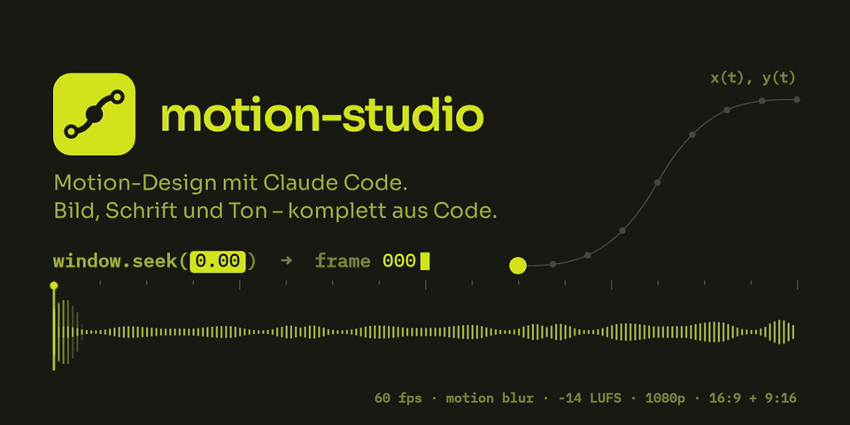
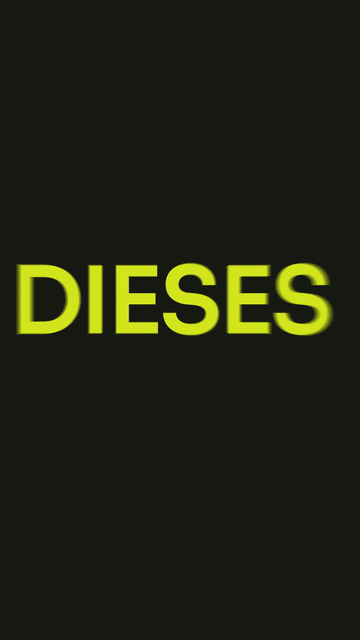
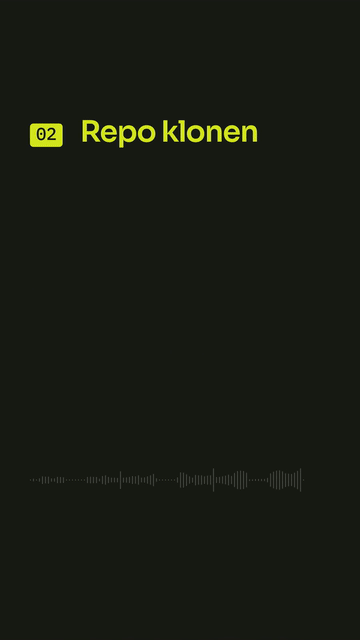
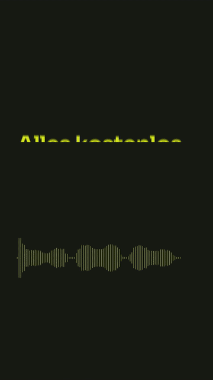
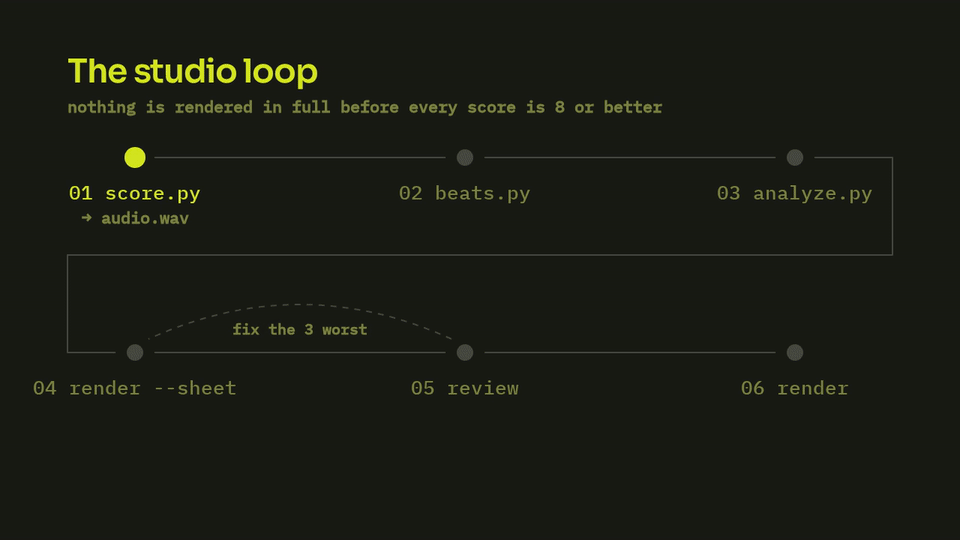
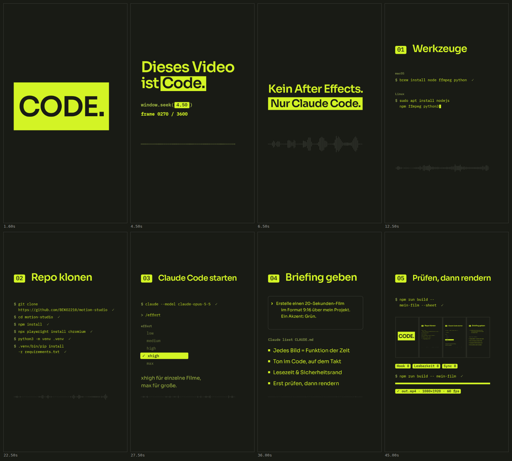
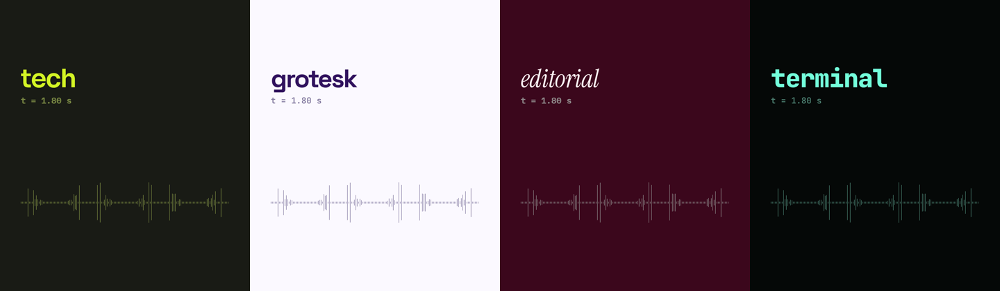

<p align="center">
  
</p>

<p align="center">
  <a href="https://github.com/BEKO2210/motion-studio/actions/workflows/render.yml"></a>
  <a href="LICENSE"></a>
  <a href="README.en.md"></a>
</p>

**Motion-Design-Filme mit Claude Code.** Bild, Schrift und Ton entstehen komplett im Code: Jeder Frame
ist eine Funktion der Zeit, die Musik und die Soundeffekte werden synthetisiert, der Renderer liefert
H.264 in 1080p mit 60 fps und echtem Motion Blur. Claude baut den Film, schaut sich einen Kontaktbogen
an, bewertet ihn, behebt die drei größten Fehler – und rendert erst dann.

Alle Bilder auf dieser Seite sind mit diesem Repo gerendert.

## Gebaut mit motion-studio

Das Instagram-Reel, das dieses Repo erklärt – komplett mit diesem Repo gebaut: Bild, Schrift, Musik
(gesampelter Flügel, Pad, Bass, Drums) und jeder Tastenanschlag im Ton. [▶ Ganzes Reel ansehen](https://github.com/BEKO2210/motion-studio/raw/main/docs/media/reel.mp4) (60 s, 9:16).

<table>
  <tr>
    <td align="center" width="33%"><br><sub><b>Hook</b> · Kinetic Type</sub></td>
    <td align="center" width="33%"><br><sub><b>Schritte</b> · getippt, Ton pro Zeichen</sub></td>
    <td align="center" width="33%"><br><sub><b>Abschluss</b> · URL tippt sich ein</sub></td>
  </tr>
</table>

## Schnellstart

Du brauchst Node.js 22+, ffmpeg, Python 3 und [Claude Code](https://claude.com/claude-code).

```bash
brew install node ffmpeg python                              # macOS
sudo apt install nodejs npm ffmpeg python3 python3-venv      # Debian/Ubuntu
```

```bash
git clone https://github.com/BEKO2210/motion-studio
cd motion-studio
npm install
npx playwright install chromium
python3 -m venv .venv && .venv/bin/pip install -r requirements.txt

npm run example                          # rendert films/example/out.mp4
```

Dann Claude Code starten und ein Briefing geben:

```bash
claude --model claude-opus-5-5           # mit /effort die Stufe wählen: xhigh, für große Filme max
```

> Erstelle einen 20-Sekunden-Film im Format 9:16 über mein Projekt. Combo 191B15-D3F425, Stil grotesk.

Claude liest [`CLAUDE.md`](CLAUDE.md) und arbeitet danach.

## Als Skill: `/motion-studio`

Der ganze Ablauf als ein Befehl in Claude Code – Briefing, Farben und Stil, Ton, Kontaktbogen-Schleife,
Render, Lieferung:

```bash
mkdir -p ~/.claude/skills && ln -s "$PWD/skill/motion-studio" ~/.claude/skills/motion-studio
```

Dann in Claude Code: `/motion-studio 30-Sekunden-Reel über mein Café, Combo 191B15-D3F425, Stil grotesk`.
Fehlt etwas im Briefing, fragt der Skill einmal nach – nie öfter.

## Der Loop

<p align="center"></p>

| | Schritt | Ergebnis |
|---|---|---|
| 01 | `score.py` synthetisiert Musik und Soundeffekte | `audio.wav`, -14 LUFS, True Peak nach AAC ≤ -1,2 dBTP |
| 02 | `beats.py` misst das Taktraster | `beats.json` |
| 03 | `lib/analyze.py` zerlegt das Spektrum pro Frame | `wave.json` für die Wellenform |
| 04 | `render.mjs --sheet` rendert ein Bild pro Beat | Kontaktbogen in Handy-Breite |
| 05 | Bewerten, die drei schlimmsten Fehler beheben | zurück zu 04, bis jede Note ≥ 8 ist |
| 06 | `render.mjs` rendert den Film | `out.mp4`, H.264, yuv420p, CRF 16 |

## Der Kontaktbogen

<p align="center"></p>

Ein Frame pro Beat, jedes Bild 412 px breit – so groß, wie das Video auf dem Handy wirkt.
Bewertet wird von 1 bis 10:

| Kriterium | Frage |
|---|---|
| Hook | Packt es in den ersten zwei Sekunden? |
| Lesbarkeit | Ist jeder Text auf dem Handy lesbar – und lange genug zu sehen? |
| Bewegung | Wirkt jede Bewegung gewollt, gibt es Ruckler oder Geisterbilder? |
| Abwechslung | Passiert alle 2–4 Sekunden etwas Neues? |
| Marke | Stimmen Schriften, Farbe, Logo? |
| Sync | Sitzt jeder Schnitt auf dem Ton? |

## Farben und Stil pro Film

Jeder Film bringt seine eigene Farbkombination und seinen eigenen Stil mit. Zwei Hex-Werte reichen –
zum Beispiel direkt aus dem [Combo Studio](https://combo.it-handwerk-stuttgart.de/) – alle Abstufungen
für Schrift, Linien und Flächen werden in OKLCH abgeleitet, der Farbton bleibt dabei erhalten.

<p align="center"></p>

| Stil | Schriften | Kombination im Bild |
|---|---|---|
| `tech` | Sora · IBM Plex Mono | Twilight Zone × Stadium Grass `191B15-D3F425` |
| `grotesk` | Space Grotesk · JetBrains Mono | #567180 Voldemort × Ghost White `31135E-FBF9FF`, `--invert` |
| `editorial` | Instrument Serif kursiv · IBM Plex Mono | #567996 Berry Chocolate × Sefid White `3B071C-FCF1F3` |
| `terminal` | JetBrains Mono | #567868 Spindrift × Reversed Grey `73FFDA-050807` |

```bash
npm run new -- reel-02 --9x16 --combo 191B15-D3F425 --style grotesk            # dunkler Grund
npm run new -- reel-03 --9x16 --combo "https://combo.it-handwerk-stuttgart.de/#191B15-D3F425" --invert
```

Im Code: `film({ ..., combo: '191B15-D3F425', style: 'editorial', invert: false })`. Die dunklere Farbe
wird Grund, die andere Schrift und Linien; Hervorhebung ist immer die Umkehrung.

## Einen eigenen Film bauen

```bash
npm run new -- mein-film --9x16 --seconds 20 --bpm 120    # legt films/mein-film/ an
npm run build -- mein-film --sheet                        # Ton, Takt, Wellenform, Kontaktbogen
npm run build -- mein-film                                # fertiges Video
```

Ein Film ist eine Funktion. Keine Zeitleiste, kein Zustand zwischen Frames:

```js
import { C, E, ease, text, film, drawBars } from '../../lib/stage.js';

function draw(ctx, t, d) {
  drawBars(ctx, d.wave, t, 120, 700, 1680, 160);                 // die Musik treibt die Wellenform
  const p = ease(t, 0.5, 0.85, E.outExpo);                       // landet auf Beat 1
  text(ctx, 'Hallo', 120, 460 + (1 - p) * 160, { size: 140 });
}

film({ width: 1920, height: 1080, fps: 60, duration: 10, blur: 6, draw });
```

Der Ton entsteht genauso im Code:

```python
from audio import *                              # lib/audio.py
mx = Mix(10.0)
mx.note(0.5, 62, vel=0.6, dur=3.0, pedal=True)   # Klavier: MIDI-Note, Anschlag, Dauer
mx.add("dry", 0.5, impact(1), 0.9)               # Soundeffekt auf Beat 1
mx.render("films/mein-film/audio.wav")           # -14 LUFS, AAC-sicherer Limiter
```

| `lib/stage.js` | | `lib/audio.py` | |
|---|---|---|---|
| `film()` | Laufzeit, Motion Blur, Schriften | `Mix` | Busse, Hall, Lautheit, Limiter |
| `ease`, `E.*` | Easing | `piano()` | Saitenmodell mit Hammer und Dämpfer |
| `text`, `code`, `tokens` | Typografie, Syntax-Farben | `tick`, `click`, `bits` | Mechanik, Datenklicks |
| `scramble` | Zeichen lösen sich auf | `snap`, `impact`, `boom` | Einschläge |
| `drawBars`, `drawTrace` | Wellenform aus dem Ton | `pulse`, `riser`, `whoosh` | Tiefe, Übergänge |
| `hash`, `mulberry32` | deterministischer Zufall | `Mix.silence()` | echte Stille, auch im Hall |

## Die Regeln

Die vollständigen Regeln stehen in [`CLAUDE.md`](CLAUDE.md). Die wichtigsten:

- **Jeder Frame ist eine Funktion der Zeit.** `window.seek(t)` malt Frame `t`. Kein `Math.random`,
  kein `setTimeout`, keine CSS-Animation – der Renderer zählt Verstöße und bricht ab.
- **Lesezeit.** Text, der gelesen werden soll, steht mindestens 1,2 s still, sonst 0,3 s pro Wort plus 0,5 s.
- **Sicherheitsrand.** 120 px im Querformat, 90 px im Hochformat. Linien laufen nie durch Text.
- **Ein Akzent.** Eine Display-Schrift, eine UI-Schrift.
- **Nichts ohne Prüfung.** Kein fertiger Render, solange eine Note unter 8 liegt.

## Zwei Formate aus einem Film

`npm run new -- <name> --both` legt beides an: `films/<name>` und `films/<name>-9x16`. Der zweite Ordner setzt `<html data-format="9x16">` und lädt denselben `film.js`. Der Code
verzweigt nur im Layout (`V`) – Timing und Ton bleiben identisch. Spalten werden zu Stapeln, Schrift
wird eingepasst, nichts wird beschnitten.

## Renderer

| Befehl | |
|---|---|
| `node render.mjs films/x` | fertiges Video `out.mp4` |
| `node render.mjs films/x --sheet` | Kontaktbogen, ein Frame pro Beat (`sheet-NN.png`) |
| `node render.mjs films/x --at 1.5,3:4:0.25` | Frames zu bestimmten Zeiten (`strip-NN.png`) |
| `node render.mjs films/x --gif 960` | zusätzlich `out.gif` als Schleife |
| `node render.mjs films/x --at 2,5 --png` | Einzelbilder in voller Größe, z. B. für Thumbnails |
| `node render.mjs films/x --lufs -18` | leiser, z. B. als Effekt-Spur unter eigener Musik |
| `node render.mjs films/x --remux` | nur den Ton eines fertigen Videos ersetzen |

## Fallen, die schon gelöst sind

| Symptom | Ursache | Lösung im Repo |
|---|---|---|
| Schrift sieht falsch aus, aber meldet „loaded“ | Stylesheet ohne `text/css` wird still verworfen | Server im Renderer setzt MIME-Typen, `film()` bricht ab, wenn eine Schrift fehlt |
| True Peak über 0 dB, obwohl die WAV sauber ist | AAC-Überschwinger bei steilen Flanken und am Stream-Anfang | 0,7 ms Anstieg pro Klang, 30 ms Einblendung, Limiter misst nach AAC-Encode |
| Taktmessung springt | punktierte Rhythmen ohne durchgehenden Puls | leiser Uhrwerk-Tick auf jedem Beat |
| Zahlen verschmieren | Motion Blur mischt verschiedene Ziffern | Zähler lesen den Frame, nicht das Blur-Sample |
| Geisterbilder bei schneller Bewegung | zu wenige Blur-Samples | `blur` pro Film oder als Funktion der Zeit |

## Aufbau

| Datei | |
|---|---|
| `CLAUDE.md` | Regeln für Claude Code |
| `render.mjs` | Renderer: Server, Kontaktbogen, Video, GIF, Remux |
| `build.mjs` · `new.mjs` | Kette in einem Befehl · neuer Film aus Vorlage |
| `lib/stage.js` | Canvas-Laufzeit, `comboPalette`, Stile |
| `lib/logo.js` · `films/brand` | das Logo – ebenfalls mit dem Studio gerendert (`brand/logo/`) |
| `lib/audio.py` · `lib/analyze.py` | Klang-Synthese und Mix · Spektrum pro Frame |
| `lib/instruments.py` · `lib/aesthetics.py` | gesampelter Flügel, Pad, Bass, Drums · das „Ohr“: bewertet einen Mix |
| `beats.py` | misst das Taktraster |
| `skill/motion-studio` | der Skill `/motion-studio` für Claude Code |
| `films/example` | kleinster lauffähiger Film |
| `films/readme-hero` · `films/readme-loop` · `films/reel-workflow` | die Animationen auf dieser Seite und das Reel |

## Lizenz

Farben: [Twilight Zone × Stadium Grass](https://combo.it-handwerk-stuttgart.de/#191B15-D3F425) – `#191B15` und `#D3F425`, ein Zwei-Farben-System: Grund Twilight, Schrift und Linien Grass in eigenen Abstufungen, Hervorhebung als Umkehrung.
Code: [MIT](LICENSE). Flügel: [Salamander Grand Piano V3](https://freepats.zenvoid.org/Piano/acoustic-grand-piano.html) von Alexander Holm, CC-BY 3.0 (`tools/fetch-samples.sh`). Schriften: Sora, IBM Plex Mono, Space Grotesk, JetBrains Mono, Instrument Serif – SIL Open Font License 1.1 (`brand/fonts/licenses`).
Gebaut von [Belkis Aslani](https://github.com/BEKO2210) mit Claude Code.
